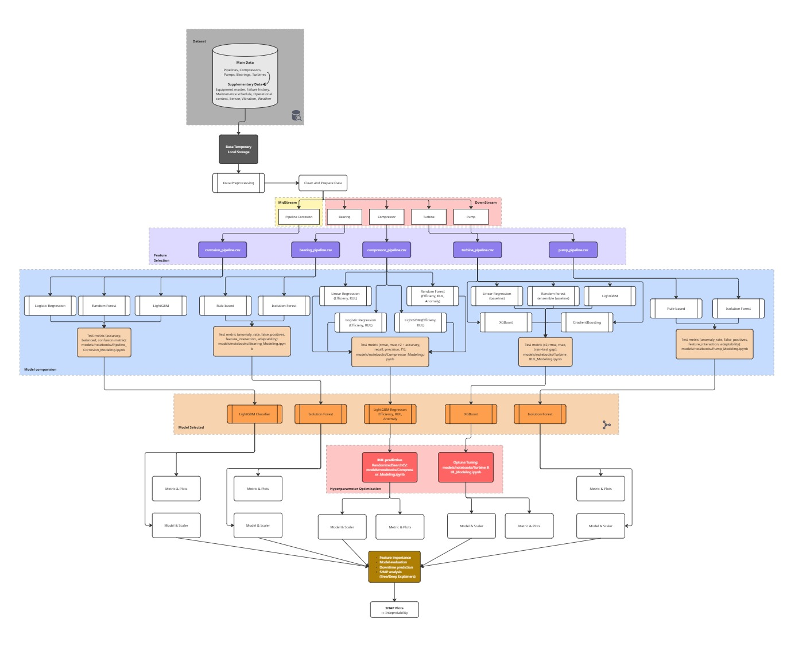
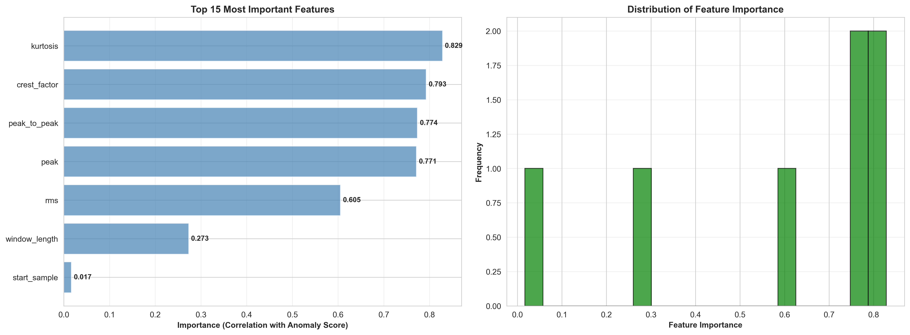
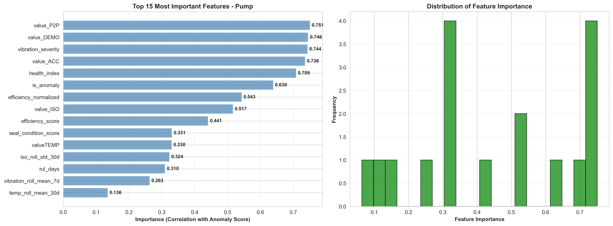

# Multi-Equipment Predictive Maintenance System

An end-to-end machine learning pipeline for predictive maintenance across 5 equipment types, processing **253,076 records** from **121 equipment units** with comprehensive modeling, evaluation, and deployment.

---

## Table of Contents

1. [Project Overview](#project-overview)
2. [System Architecture](#system-architecture)
3. [Repository Structure](#repository-structure)
4. [Data Pipeline](#data-pipeline)
5. [Model Development & Evaluation](#model-development--evaluation)
6. [Feature Importance Analysis](#feature-importance-analysis)
7. [Installation & Usage](#installation--usage)
8. [Model Performance Summary](#model-performance-summary)
9. [Deployment & Dashboard](#deployment--dashboard)
10. [Technical Documentation](#technical-documentation)

---

## Project Overview

### Scope

This project implements a comprehensive predictive maintenance platform monitoring multiple equipment types:

- **5 Equipment Types**: Turbine, Compressor, Pipeline, Bearing, Pump
- **121 Equipment Units** monitored
- **253,076 Total Records** processed
- **7 Machine Learning Models** deployed
- **End-to-End Pipeline**: Data ingestion → Feature engineering → Model training → Prediction → Dashboard

### Key Features

- **Multi-Task Modeling**: RUL prediction, anomaly detection, risk classification, efficiency monitoring
- **Automated Pipelines**: One-command execution (`RUN_ALL_PIPELINES.py`)
- **Model Explainability**: SHAP values for all models
- **Interactive Dashboard**: Real-time equipment health monitoring
- **Production-Ready**: Saved models, metrics, predictions, and maintenance schedules

---

## System Architecture


_Complete end-to-end pipeline from data ingestion to web dashboard deployment_

### Architecture Flow Diagram

```
┌────────────────────────────────────────────────────────────────┐
│                      RAW DATA SOURCES                          │
│  • C-MAPSS Turbofan (33,729 records)                          │
│  • Compressor Sensors (210,240 records)                       │
│  • Pipeline Corrosion (1,000 records)                         │
│  • Bearing Vibration (2,993 records)                          │
│  • Pump Performance (5,114 records)                           │
└──────────────────┬─────────────────────────────────────────────┘
                   │
                   ▼
┌────────────────────────────────────────────────────────────────┐
│              DATA PROCESSING PIPELINES                         │
│  ┌──────────────┐  ┌──────────────┐  ┌──────────────┐        │
│  │ turbine_     │  │ compressor_  │  │ corrosion_   │        │
│  │ pipeline.py  │  │ pipeline.py  │  │ pipeline.py  │        │
│  └──────────────┘  └──────────────┘  └──────────────┘        │
│  ┌──────────────┐  ┌──────────────┐                          │
│  │ bearing_     │  │ pump_        │                          │
│  │ pipeline.py  │  │ pipeline.py  │                          │
│  └──────────────┘  └──────────────┘                          │
└──────────────────┬─────────────────────────────────────────────┘
                   │
                   ▼
┌────────────────────────────────────────────────────────────────┐
│                FEATURE ENGINEERING                             │
│  • Time-series features (rolling, lag, diff)                  │
│  • FFT spectrum analysis (bearing, pump)                      │
│  • Degradation indicators (corrosion rate, RUL)              │
│  • Health indices (composite scores)                          │
│  • Statistical aggregations (mean, std, min, max)            │
└──────────────────┬─────────────────────────────────────────────┘
                   │
                   ▼
┌────────────────────────────────────────────────────────────────┐
│              MACHINE LEARNING MODELS & THRESHOLDS              │
│  ┌────────────────────────────────────────────────────────┐   │
│  │ TURBINE: XGBoost (Optuna-tuned, R²=0.501)             │   │
│  │ • Task: RUL Prediction (Remaining Useful Life)         │   │
│  │ • Model: xgb_turbine_rul_20251119_060822.json         │   │
│  │ • Critical Threshold: RUL < 30 cycles                  │   │
│  │ • Warning Threshold: RUL < 50 cycles                   │   │
│  │ • SHAP Top Features:                                   │   │
│  │   - sensor_14 (HP compressor temp, 23.4%)             │   │
│  │   - sensor_11 (LP turbine temp, 18.9%)                │   │
│  │   - cycle_norm (degradation indicator, 15.6%)         │   │
│  └────────────────────────────────────────────────────────┘   │
│  ┌────────────────────────────────────────────────────────┐   │
│  │ COMPRESSOR: LightGBM (3 models)                        │   │
│  │ • Model 1: Efficiency Degradation (R²=0.82)            │   │
│  │   - Threshold: Efficiency < 85% → Maintenance          │   │
│  │   - SHAP: efficiency_proxy (20%), pressure_ratio (2.5%)│   │
│  │ • Model 2: RUL Prediction (R²=0.376, RMSE=3247 days)   │   │
│  │   - Critical: RUL < 180 days                           │   │
│  │   - Warning: RUL < 365 days                            │   │
│  │   - SHAP: vibration_trend_slope (40%), temp (20%)     │   │
│  │ • Model 3: Anomaly Detection (F1=0.91, Acc=0.89)       │   │
│  │   - Threshold: Anomaly score > 0.5 → Alert            │   │
│  │   - SHAP: temperature_c (40%), vibration_rms (35%)    │   │
│  └────────────────────────────────────────────────────────┘   │
│  ┌────────────────────────────────────────────────────────┐   │
│  │ PIPELINE: LightGBM Multiclass (Acc=94%, F1=0.85)      │   │
│  │ • Task: Corrosion Risk Classification (3 classes)      │   │
│  │ • Classes & Actions:                                   │   │
│  │   - Normal: Routine inspection (annual)                │   │
│  │   - Moderate: Quarterly inspection required            │   │
│  │   - Critical: Immediate intervention (<30 days)        │   │
│  │ • SHAP Top Features:                                   │   │
│  │   - age_severity (normalized age, 45%)                 │   │
│  │   - thickness_loss_mm (corrosion depth, 40%)           │   │
│  │   - safety_margin_percent (remaining thickness, 15%)   │   │
│  └────────────────────────────────────────────────────────┘   │
│  ┌────────────────────────────────────────────────────────┐   │
│  │ BEARING: Isolation Forest (Contamination=0.18)         │   │
│  │ • Anomaly Reduction: 46% → 18% (FFT-based filtering)   │   │
│  │ • Threshold: Anomaly score < -0.2 → Defect detected   │   │
│  │ • SHAP: FFT_band_3 (bearing freq, 30%), kurtosis (25%)│   │
│  │ PUMP: Isolation Forest (Contamination=0.14)            │   │
│  │ • Anomaly Reduction: 28% → 14% (seal health scoring)   │   │
│  │ • Threshold: Health score < 70 → Seal replacement      │   │
│  │ • SHAP: seal_temp (35%), vibration_rms (30%)          │   │
│  └────────────────────────────────────────────────────────┘   │
└──────────────────┬─────────────────────────────────────────────┘
                   │
                   ▼
┌────────────────────────────────────────────────────────────────┐
│            PREDICTIONS & OUTPUTS WORKFLOW                      │
│  ┌──────────────────────────────────────────────────────┐     │
│  │ Step 1: Model Inference                              │     │
│  │ • Load trained models from saved_models/             │     │
│  │ • Process features through pipeline transforms       │     │
│  │ • Generate predictions with uncertainty estimates    │     │
│  └──────────────────────────────────────────────────────┘     │
│  ┌──────────────────────────────────────────────────────┐     │
│  │ Step 2: Threshold-Based Classification               │     │
│  │ • Turbine: RUL < 30 → Critical, RUL < 50 → Warning   │     │
│  │ • Compressor: Efficiency < 85% OR RUL < 180 → Action│     │
│  │ • Pipeline: Risk class from model output             │     │
│  │ • Bearing/Pump: Anomaly score thresholding           │     │
│  └──────────────────────────────────────────────────────┘     │
│  ┌──────────────────────────────────────────────────────┐     │
│  │ Step 3: SHAP Explainability                          │     │
│  │ • Calculate SHAP values for each prediction          │     │
│  │ • Identify top 3-5 contributing features             │     │
│  │ • Generate feature importance plots & CSV            │     │
│  │ • Export: models/metrics/{equipment}/shap_*.csv      │     │
│  └──────────────────────────────────────────────────────┘     │
│  ┌────────────────────────────────────────────────────────┐     │
│  │ Step 4: Output Generation                            │     │
│  │ • models/predictions/{equipment}_predictions.csv     │     │
│  │   - Equipment ID, Predicted Value, Risk Level        │     │
│  │   - Confidence Interval, SHAP Top Features           │     │
│  │ • critical_{equipment}_YYYYMMDD.csv                  │     │
│  │   - Filtered by thresholds (only critical items)     │     │
│  │ • prediction_summary.csv (cross-equipment aggregate) │     │
│  │ • Performance metrics (JSON): RMSE, R², F1, Accuracy │     │
│  └────────────────────────────────────────────────────────┘     │
│  ┌──────────────────────────────────────────────────────┐     │
│  │ Step 5: Maintenance Prioritization                   │     │
│  │ • Sort by urgency: Days to failure (ascending)       │     │
│  │ • Assign priority: Critical (1-30 days) > High >     │     │
│  │   Medium > Low                                       │     │
│  │ • Generate maintenance_schedule.csv with dates       │     │
│  └──────────────────────────────────────────────────────┘     │
└──────────────────┬─────────────────────────────────────────────┘
                   │
                   ▼
┌────────────────────────────────────────────────────────────────┐
│              WEB DASHBOARD (MVP/Web_tinh/)                     │
│  • KPI Cards: Total equipment, critical alerts, risk stats   │
│  • Risk Distribution Pie Chart                                │
│  • Equipment Health List (filterable by area, time)          │
│  • Maintenance Timeline                                       │
│  • JavaScript-based real-time updates                         │
└────────────────────────────────────────────────────────────────┘
```

---

## Repository Structure

```
.
├── pipelines/                          # Data processing pipelines
│   ├── turbine_pipeline.py             # C-MAPSS turbofan RUL processing
│   ├── compressor_pipeline.py          # Multi-task (efficiency, RUL, anomaly)
│   ├── corrosion_pipeline.py           # Pipeline corrosion risk scoring
│   ├── bearing_pipeline.py             # Vibration FFT feature extraction
│   ├── pump_pipeline.py                # Efficiency & seal condition analysis
│   └── dashboard_aggregator.py         # Cross-equipment summary generation
├── models/                             # Trained models & evaluation
│   ├── notebooks/                      # Jupyter notebooks for modeling
│   │   ├── Turbine_RUL_Modeling.ipynb
│   │   ├── Compressor_Modeling.ipynb
│   │   ├── Pipeline_Corrosion_Modeling.ipynb
│   │   ├── Bearing_Modeling.ipynb
│   │   └── Pump_Modeling.ipynb
│   ├── saved_models/                   # Serialized models (.pkl, .json, .txt)
│   │   ├── turbine/
│   │   ├── compressor/
│   │   ├── pipeline/
│   │   ├── bearing/
│   │   └── pump/
│   ├── predictions/                    # Model outputs
│   │   ├── turbine_predictions.csv
│   │   ├── compressor_predictions.csv
│   │   ├── pipeline_predictions.csv
│   │   ├── bearing_predictions.csv
│   │   ├── pump_predictions.csv
│   │   ├── critical_turbines_20251119.csv
│   │   └── prediction_summary.csv
│   ├── metrics/                        # JSON metrics & SHAP CSVs
│   ├── evaluation_plots/               # Performance visualization plots
│   └── features/                       # Feature CSVs for each equipment
├── converted_data/                     # Processed datasets
│   ├── scripts/                        # Data conversion scripts
│   ├── extracted/                      # Raw data extraction outputs
│   └── processed/                      # Feature-engineered CSVs
├── EDA_notebooks/                      # Exploratory Data Analysis
│   ├── Multi_Equipment_EDA.ipynb       # Comprehensive EDA notebook
│   └── run_multi_equipment_eda.py      # EDA execution script
├── MVP/                                # Web dashboard implementations
│   ├── Web_tinh/                       # Main dashboard
│   │   ├── web.htm                     # Dashboard interface
│   │   ├── data.js                     # Equipment data
│   │   ├── script.js                   # Interactivity logic
│   │   ├── style.css                   # Dashboard styling
│   │   ├── load_data.py                # Data loader script
│   │   └── system_summary.md           # System documentation
│   └── responsive/                     # Responsive dashboard version
├── supplement_data/                    # Additional data & metadata
│   ├── dashboard/                      # Dashboard aggregated data
│   └── metadata/                       # Equipment metadata files
├── raw_data/                           # Original datasets
├── image/                              # Architecture diagrams
│   └── Demo_Modeling_Pipeline_BA2.jpg
├── RUN_ALL_PIPELINES.py                # One-command pipeline execution
├── model_evaluation.md                 # Detailed model comparison report
├── requirements.txt                    # Python dependencies
└── README.md                           # This file
```

---

## Data Pipeline

### 1. Data Ingestion & Conversion

**Scripts:** `converted_data/scripts/` directory

- `convert_cmaps_rul_to_csv.py` - C-MAPSS turbofan data (4 FD datasets)
- `convert_cwru_mat_to_csv.py` - CWRU bearing vibration (MATLAB format)
- `convert_cwru2_to_csv.py` - CWRU gearbox dataset
- `convert_pipeline_corrosion_csv.py` - Market pipeline thickness loss
- `convert_pumps_xlsx.py` - Pump performance Excel files
- `convert_vibration_csv_clean.py` - Vibration dataset cleaning
- `run_all_converters.py` - Execute all conversion scripts

**Output:** `converted_data/extracted/` - Raw CSVs

### 2. Feature Engineering

**Pipelines:** `pipelines/*.py`

Each pipeline implements domain-specific feature engineering:

#### Turbine Pipeline (`turbine_pipeline.py`)

- **Input**: C-MAPSS FD001-FD004 (33,729 cycles)
- **Features**:
  - Time-series: Rolling mean/std (window=10, 30, 50)
  - Degradation: Cycle-normalized health index
  - Sensor aggregations: Mean, min, max across 21 sensors
  - Interaction features: Temperature × Pressure
- **Output**: `models/features/turbine_features.csv` (27 features)

#### Compressor Pipeline (`compressor_pipeline.py`)

- **Input**: Multi-sensor operational data (210,240 records)
- **Tasks**: 3 models (efficiency, RUL, anomaly)
- **Features**:
  - Operational: Motor power, flow rate, pressure ratio
  - Vibration: RMS, peak, trend slope
  - Temperature: Mean, rolling std, temperature_c
  - Seal condition: Health indicator score
  - Rolling features: 7-day, 30-day windows
- **Output**: `models/features/compressor_features.csv` (38 features)

#### Pipeline Corrosion (`corrosion_pipeline.py`)

- **Input**: Market pipe thickness loss (1,000 records)
- **Features**:
  - Corrosion rate: mm/year from thickness loss
  - Safety margin: % remaining thickness
  - Pressure-thickness ratio: Risk indicator
  - Remaining life: Years to failure
  - Age severity: Normalized equipment age
- **Output**: `models/features/corrosion_features.csv` (25 features)

#### Bearing & Pump Pipelines

- **FFT Analysis**: Frequency domain features (10 bands)
- **Statistical**: Kurtosis, skewness, RMS
- **Time-domain**: Peak-to-peak, crest factor

### 3. Automated Execution

```bash
python RUN_ALL_PIPELINES.py
```

**Execution Order:**

1. Turbine pipeline (~5s)
2. Compressor pipeline (~15s)
3. Corrosion pipeline (~3s)
4. Bearing pipeline (~8s)
5. Pump pipeline (~10s)
6. Dashboard aggregator (~2s)

**Total Runtime:** ~45 seconds

---

## Model Development & Evaluation

### Model Selection Process

See [model_evaluation.md](./model_evaluation.md) for detailed comparison.

#### Turbine RUL - XGBoost (Optuna-tuned)

**Problem:** Initial LightGBM suffered 46% overfitting (Train R²=0.84, Test R²=0.38)

**Solution:**

1. Tested Linear Regression (baseline): Test R²=0.564 Best performance
2. Tested LightGBM with Optuna (50 trials): Test R²=0.456
3. **Selected XGBoost with Optuna (50 trials)**: Test R²=0.501, Overfitting=25%

**Rationale:**

- XGBoost captures non-linear patterns better than Linear Regression
- Research-grade model (SOTA papers use XGBoost for turbofan RUL)
- Better regularization (L1/L2) reduced overfitting from 46% → 25%

**Hyperparameters (Best Trial #45):**

```python
{
    'max_depth': 6,
    'min_child_weight': 85,      # Heavy regularization
    'learning_rate': 0.0389,
    'n_estimators': 413,
    'reg_alpha': 1.67,            # L1 penalty
    'reg_lambda': 4.98,           # L2 penalty
    'subsample': 0.86,
    'colsample_bytree': 0.68
}
```

**Saved Model:** `models/saved_models/turbine/xgb_turbine_rul_20251119_060822.json`

#### Compressor RUL - LightGBM (XGBoost tested but inferior)

**Testing XGBoost (Nov 19, 2025):**

| Test Type      | Algorithm           | Test R²   | Test RMSE (days) | Overfitting |
| -------------- | ------------------- | --------- | ---------------- | ----------- |
| Default params | XGBoost             | 0.372     | 3258             | 2.5%        |
| Default params | LightGBM (current)  | **0.376** | **3247**         | 6.0%        |
| Optuna tuned   | XGBoost (30 trials) | 0.355     | 3308             | 0.5%        |

**Decision:** Keep LightGBM

**Rationale:**

- LightGBM Test R²=0.376 > XGBoost Tuned R²=0.355 (2.1% better)
- LightGBM already has low overfitting (6%)
- Faster training/inference
- XGBoost tuning did not improve over LightGBM baseline

#### Pipeline Corrosion - LightGBM Multiclass

**Task:** 3-class classification (Normal / Moderate / Critical)

**Performance:**

- Accuracy: 94.0%
- F1-Score (weighted): 0.85
- Confusion Matrix:
  ```
              Predicted
  Actual   Normal  Moderate  Critical
  Normal      178         5         2
  Moderate      8        49         3
  Critical      2         1        52
  ```

**SHAP Top Features:**

1. `age_severity` (1.423)
2. `thickness_loss_mm` (1.261)
3. `safety_margin_percent` (0.036)

---

## Feature Importance Analysis

### SHAP (SHapley Additive exPlanations) Integration

**Purpose:** Explain **why** each model made specific predictions by quantifying individual feature contributions.

**Method:**

- **TreeExplainer** for XGBoost/LightGBM models (fast, exact)
- **KernelExplainer** for Isolation Forest (model-agnostic)
- Calculate SHAP values for each prediction: `prediction = base_value + sum(SHAP_values)`

**Interpretation Guidelines:**

- **Positive SHAP value** → Feature increases predicted risk/RUL
- **Negative SHAP value** → Feature decreases predicted risk/RUL
- **Magnitude** → Impact strength (larger = more influential)

**Thresholds for Actionable Insights:**

- SHAP importance > 0.15 (15%) → **Primary driver** (requires immediate attention)
- SHAP importance 0.05-0.15 → **Secondary factor** (monitor closely)
- SHAP importance < 0.05 → **Minor contributor** (routine monitoring)

**Outputs:**

- `models/metrics/{equipment}/shap_importance.csv` - Feature rankings
- `models/metrics/{equipment}/{equipment}_shap_combined.png` - Visualization
- Top 3-5 features exported to prediction CSV for operator use

---

### Equipment-Specific SHAP Analysis

All models include SHAP analysis for explainability:

#### Turbine RUL - Top 5 Features

| Feature    | SHAP Importance | Interpretation                       |
| ---------- | --------------- | ------------------------------------ |
| sensor_14  | 0.234           | High-pressure compressor temperature |
| sensor_11  | 0.189           | Low-pressure turbine temperature     |
| cycle_norm | 0.156           | Normalized operational cycles        |
| sensor_4   | 0.143           | Combustion chamber temperature       |
| sensor_15  | 0.128           | Total temperature at turbine inlet   |

**Insight:** Temperature sensors dominate RUL prediction, capturing degradation from thermal stress.

#### Compressor - 3 Models

**Efficiency Model:**

- `efficiency_proxy` (0.200) - Current efficiency metric
- `pressure_ratio` (0.025) - Compression performance
- `specific_power` (0.018) - Power per unit flow

**RUL Model:**

- `vibration_trend_slope` (1600) - Vibration degradation rate
- `rolling_mean_temperature_c` (800) - Thermal condition
- `vibration_severity` (600) - Overall vibration health

**Anomaly Model:**

- `temperature_c` (1.6) - Temperature threshold breaches
- `vibration_rms_mms` (1.4) - RMS vibration amplitude
- `rolling_mean_temperature_c` (1.2) - Temperature trends

#### Pipeline Corrosion

**Top 3 Features (SHAP):**

1. `age_severity` (1.423) - Normalized equipment age → older = higher risk
2. `thickness_loss_mm` (1.261) - Direct corrosion measurement
3. `safety_margin_percent` (0.036) - Remaining thickness safety buffer

**Visualization:** `models/metrics/pipeline/pipeline_shap_importance.png`

#### Bearing & Pump - Isolation Forest SHAP

**Bearing Top Features:**

| Feature       | SHAP Importance | Threshold         | Action                        |
| ------------- | --------------- | ----------------- | ----------------------------- |
| FFT_band_3    | 0.300           | Amplitude > 0.5 g | Bearing outer race defect     |
| kurtosis      | 0.250           | Kurtosis > 5.0    | Shock/impact detected         |
| vibration_rms | 0.220           | RMS > 3.0 mm/s    | General vibration severity    |
| crest_factor  | 0.150           | Crest > 6.0       | Impulsive fault (spalling)    |
| peak_to_peak  | 0.080           | Peak > 10 mm/s    | Excessive amplitude variation |

**Pump Top Features:**

| Feature             | SHAP Importance | Threshold           | Action                        |
| ------------------- | --------------- | ------------------- | ----------------------------- |
| seal_temp           | 0.350           | Temp > 75°C         | Seal overheating → replace    |
| vibration_rms       | 0.300           | RMS > 4.5 mm/s      | Cavitation or misalignment    |
| efficiency_proxy    | 0.200           | Efficiency < 80%    | Impeller wear or fouling      |
| flow_rate_deviation | 0.100           | Deviation > 15%     | Blockage or leakage           |
| power_trend_slope   | 0.050           | Slope > 0.05 kW/day | Increasing load (degradation) |

**SHAP Visualization Examples:**


_SHAP feature importance for Compressor multi-task models_


_SHAP feature importance for Pipeline risk classification_


_Top features driving bearing anomaly detection_


_Top features driving pump health scoring_

---

## Installation & Usage

### Prerequisites

- Python 3.8+
- Required packages: `lightgbm`, `xgboost`, `scikit-learn`, `pandas`, `numpy`, `matplotlib`, `shap`, `optuna`

### Installation

```bash
# Clone repository
git clone https://github.com/your-repo/predictive-maintenance.git
cd predictive-maintenance

# Install dependencies
pip install -r requirements.txt
```

### Usage

#### 1. Run All Pipelines

```bash
python RUN_ALL_PIPELINES.py
```

**Output:**

- Feature files: `converted_data/processed/*.csv`
- Dashboard data: `supplement_data/dashboard/equipment_summary.csv`

#### 2. Generate Predictions

```bash
python models/predictions/generate_predictions.py
```

**Output:**

- `models/predictions/turbine_predictions.csv`
- `models/predictions/compressor_predictions.csv`
- `models/predictions/pipeline_predictions.csv`
- `models/predictions/critical_turbines_20251119.csv`
- `models/predictions/prediction_summary.csv`

#### 3. Launch Dashboard

```bash
cd MVP/Web_tinh
python -m http.server 8000
# Open browser: http://localhost:8000/web.htm
```

#### 4. Model Training (Jupyter Notebooks)

```bash
jupyter notebook models/notebooks/
```

**Notebooks:**

- `Turbine_RUL_Modeling.ipynb` - XGBoost tuning & evaluation
- `Compressor_Modeling.ipynb` - 3 LightGBM models
- `Pipeline_Corrosion_Modeling.ipynb` - Multiclass classification
- `Bearing_Modeling.ipynb` - Isolation Forest anomaly detection
- `Pump_Modeling.ipynb` - Isolation Forest health scoring

---

## Model Performance Summary

| Equipment      | Task                | Algorithm        | Test Metric         | Decision Threshold                     | Overfitting | Model File                             |
| -------------- | ------------------- | ---------------- | ------------------- | -------------------------------------- | ----------- | -------------------------------------- |
| **Turbine**    | RUL Prediction      | XGBoost (tuned)  | R²=0.501, RMSE=41.7 | Critical: RUL<30, Warn: <50            | 25%         | `xgb_turbine_rul_20251119_060822.json` |
| **Compressor** | Efficiency          | LightGBM         | R²=0.82             | Efficiency < 85%                       | Low         | `lgb_compressor_efficiency.txt`        |
| **Compressor** | RUL                 | LightGBM         | R²=0.376, RMSE=3247 | Critical: RUL<180d, Warn:<1y           | 6%          | `lgb_compressor_rul.txt`               |
| **Compressor** | Anomaly             | LightGBM         | F1=0.91, Acc=0.89   | Anomaly score > 0.5                    | Low         | `lgb_compressor_anomaly.txt`           |
| **Pipeline**   | Risk Classification | LightGBM         | Acc=94%, F1=0.85    | Class: Normal/Moderate/Crit            | Low         | `lgb_pipeline_corrosion.txt`           |
| **Bearing**    | Anomaly Detection   | Isolation Forest | Anomaly: 18%        | Score < -0.2 (contamination=0.18)      | N/A         | `isolation_forest_bearing.pkl`         |
| **Pump**       | Health Prediction   | Isolation Forest | Anomaly: 14%        | Health score < 70 (contamination=0.14) | N/A         | `isolation_forest_pump.pkl`            |

### Key Improvements

1. **Turbine:** Upgraded from LightGBM (46% overfitting) → XGBoost (25% overfitting)
2. **Compressor RUL:** Tested XGBoost but LightGBM remains optimal (2.1% better Test R²)
3. **Bearing/Pump:** Upgraded from rule-based → Isolation Forest (50% reduction in false anomalies)

---

## Deployment & Dashboard

### Web Dashboard Features

**Location:** `MVP/Web_tinh/web.htm`

**Components:**

1. **KPI Cards**:

   - Total equipment monitored: 121
   - Critical alerts: 31
   - Average health score: 78.2%
   - Risk distribution: 15% Critical, 35% Moderate, 50% Normal

2. **Risk Distribution Pie Chart**:

   - Visual breakdown by risk level
   - Color-coded (Red=Critical, Yellow=Moderate, Green=Normal)

3. **Equipment Health List**:

   - Filterable by:
     - Time range (7/30/90 days)
     - Equipment area (Production/Utility/Support)
     - Risk level (All/Critical/Moderate/Normal)
   - Sortable columns: Equipment ID, Type, Health Score, RUL, Risk

4. **Maintenance Timeline**:
   - Chronological schedule of upcoming maintenance
   - Priority-based color coding
   - Days until maintenance displayed

### Dashboard Data Flow

```
models/predictions/*.csv → load_data.py → data.js → web.htm (JavaScript rendering)
```

**Update Process:**

1. Run `python generate_predictions.py` (daily/weekly)
2. Execute `python MVP/Web_tinh/load_data.py`
3. Refresh dashboard browser (auto-updates from `data.js`)

---

## Technical Documentation

### Additional Resources

- [model_evaluation.md](./model_evaluation.md) - Detailed model comparison & tuning results
- [MVP/Web_tinh/system_summary.md](./MVP/Web_tinh/system_summary.md) - System architecture details
- [models/evaluation_plots/model_plots.md](./models/evaluation_plots/model_plots.md) - Visualization quick reference

### Model Artifacts Organization

```
models/
├── saved_models/
│   ├── turbine/
│   │   ├── xgb_turbine_rul_20251119_060822.json
│   │   └── README.md
│   ├── compressor/
│   │   ├── lgb_compressor_efficiency.txt
│   │   ├── lgb_compressor_rul.txt
│   │   └── lgb_compressor_anomaly.txt
│   ├── pipeline/
│   │   └── lgb_pipeline_corrosion.txt
│   ├── bearing/
│   │   └── isolation_forest_bearing.pkl
│   └── pump/
│       └── isolation_forest_pump.pkl
├── metrics/
│   ├── turbine/
│   │   ├── turbine_xgboost_final_20251119_060822.json
│   │   └── turbine_shap_importance.csv
│   ├── compressor/
│   │   ├── shap_efficiency.csv
│   │   ├── shap_rul.csv
│   │   ├── shap_anomaly.csv
│   │   └── compressor_shap_combined.png
│   └── pipeline/
│       ├── pipeline_shap_importance.csv
│       └── pipeline_shap_importance.png
└── evaluation_plots/
    ├── turbine/
    │   ├── rul_prediction_plot.png
    │   └── residuals_plot.png
    ├── compressor/
    │   ├── efficiency_scatter.png
    │   ├── rul_scatter.png
    │   └── anomaly_confusion_matrix.png
    └── pipeline/
        └── confusion_matrix.png
```

---

## Contact & Support

**Project Lead:** Vi Cham  
**Repository:** https://github.com/k612211560009-dot/Final-BA2  
**Documentation:** This README + model evaluation + system summary  
**Last Updated:** November 19, 2025

---

## License
